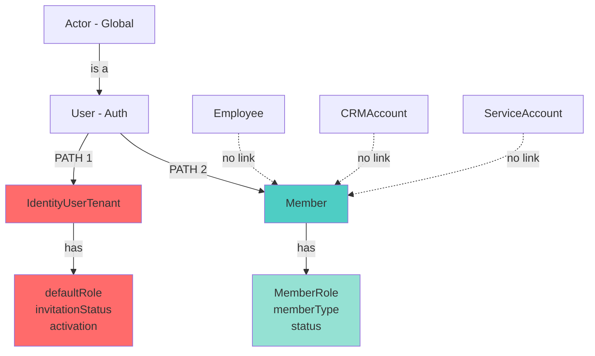
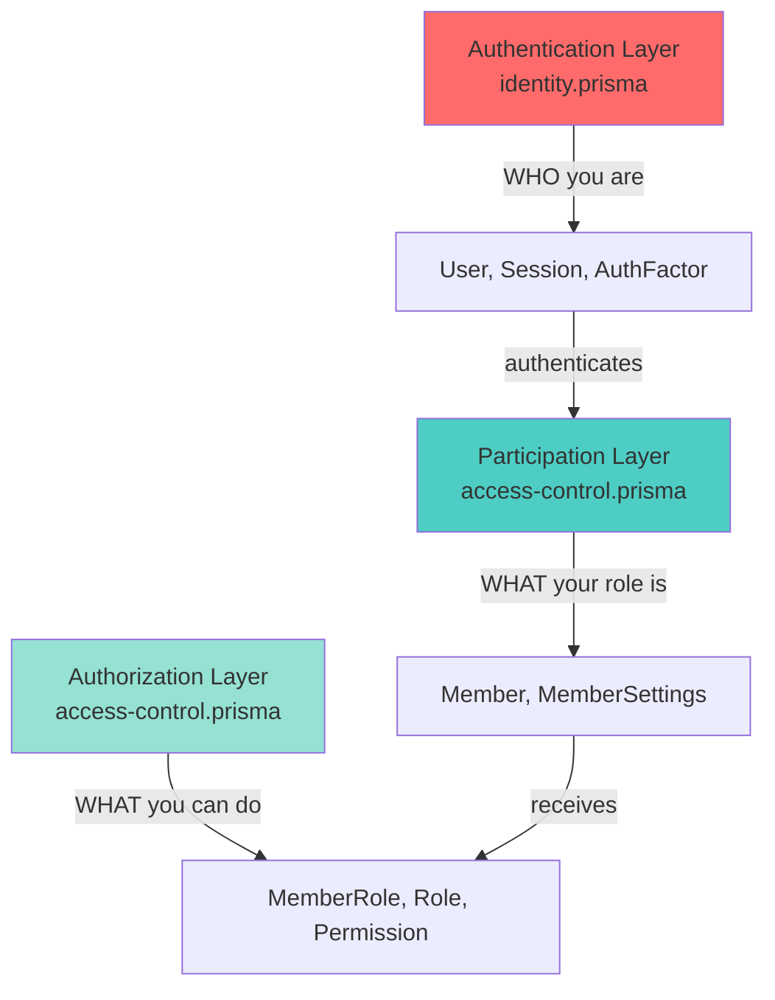
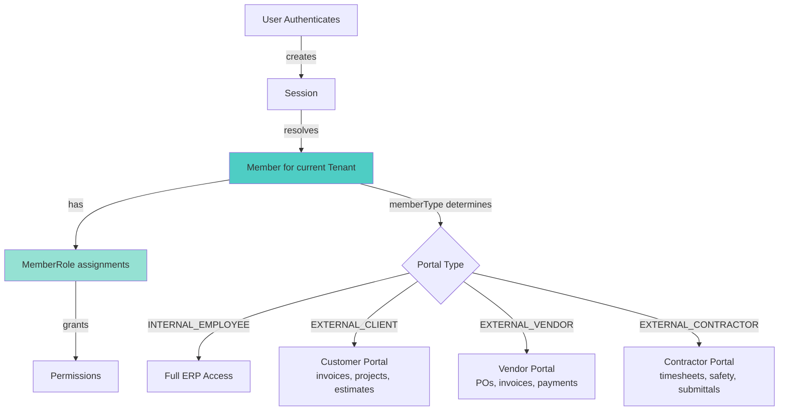

# Enterprise Multi-Tenant ERP - Actor-Centric Architectural Audit

> **Document Type:** Architecture Review & Gap Analysis  
> **Subject:** Actor-Centric Identity, Membership & Multi-Tenant Participation Architecture  
> **Platform:** Enterprise Construction ERP (363 Models, 80+ Modules)  
> **Date:** November 14, 2025  
> **Status:** 🔴 Critical Gaps Identified — Migration Required  
> **Reviewer:** Senior Enterprise Architect  
> **Sources of Truth:** `ERP_Modules.md`, `READMEv2.md`, `access-control.prisma`, `identity.prisma`

---

## Executive Summary

### TL;DR

The ERP platform demonstrates **world-class enterprise architecture** with 363 models across 80+ modules, comprehensive **Actor-centric audit patterns**, and sophisticated multi-tenant isolation. However, the current implementation **lacks proper integration of the Member entity** as the canonical participation layer, with `IdentityUserTenant` conflating authentication concerns with tenant participation.

### Critical Finding

**The platform ALREADY HAS a `Member` entity in `access-control.prisma`**, but:

1. `IdentityUserTenant` in `identity.prisma` duplicates membership functionality with "default roles" and "activation tracking"
2. The relationship between `User → IdentityUserTenant → Member` is unclear/fragmented
3. `Employee`, `CRMAccount`, and other domain entities lack explicit links to `Member`
4. `ServiceAccount` and `ApiKey` participation context is ambiguous
5. External participants (clients, vendors, contractors) have no formal path to `Member`

### Impact Without Proper Member Integration

❌ **Multi-tenant user participation** blocked (user cannot cleanly work for multiple tenant orgs)  
❌ **External participant access** undefined (clients, vendors, partners lack formal system access model)  
❌ **Contractor ↔ Employee transitions** require manual orchestration  
❌ **Unified RBAC** fragmented (`IdentityUserTenant.defaultRole` vs `MemberRole` confusion)  
❌ **ServiceAccount authorization** lacks participation context  
❌ **Delegation chains** incomplete without Member context  
❌ **Actor audit incomplete** - tracks WHO but not IN WHAT CAPACITY

### Recommendation

**Deprecate `IdentityUserTenant`** and **fully adopt `Member`** as the exclusive tenant participation entity:

```
Actor (global identity) → User (login) → Member (participation) → MemberRole (authorization)
```

**Migration Scope:** ~30-40 tables affected, 4-phase implementation, backward-compatible path available.

---

## 1. Platform Foundation & Current State

### 1.1 Architecture Quality: 8.5/10

**Strengths (+8.5 points):**

| Category | Evidence | Impact |
|----------|----------|--------|
| ✅ **Actor Audit Pattern** | All 363 models include `createdByActorId`, `updatedByActorId`, `deletedByActorId` | Complete forensic audit, SOX/GDPR ready |
| ✅ **Multi-Tenant Isolation** | Composite FKs `[tenantId, id]`, RLS enforcement, one-sided relations | Zero cross-tenant leakage |
| ✅ **Financial Traceability** | `Estimate → Project → Invoice → Payment` with `DocumentGroup` | Immutable 1:1:1 business flow |
| ✅ **Member Entity Exists** | `Member`, `MemberSettings`, `MemberRole` in `access-control.prisma` | Foundation already present |
| ✅ **RBAC/ABAC** | `Permission` (global), `Role`, `RolePermission`, `AccessPolicy` | Sophisticated authorization engine |
| ✅ **Delegation** | `DelegationGrant`, `DelegationConstraint` with temporal validity | Acting-on-behalf support |
| ✅ **ServiceAccount** | `ServiceAccount`, `ServiceAccountKey`, `ApiKey` | System identity separation |
| ✅ **Event Sourcing** | `DomainEvent`, `EventProjection`, `EventSnapshot` | Immutable event log |

**Gap (-0.5 deduction):**

- `IdentityUserTenant` duplicates `Member` functionality, creating confusion
- Domain entities (`Employee`, `CRMAccount`) lack explicit `Member` links
- External participant model incomplete

### 1.2 The Actor Pattern — Platform Cornerstone

**Every entity follows this pattern:**

```prisma
model AnyEntity {
  id String @id @default(uuid(7)) @db.Uuid
  
  // WHO performed actions
  createdByActorId String? @db.Uuid
  updatedByActorId String? @db.Uuid  
  deletedByActorId String? @db.Uuid
  
  // Full Actor relations (on parent entities only - Pattern B)
  createdByActor Actor? @relation("EntityCreatedBy", fields: [createdByActorId], references: [id], onDelete: SetNull)
  updatedByActor Actor? @relation("EntityUpdatedBy", fields: [updatedByActorId], references: [id], onDelete: SetNull)
  deletedByActor Actor? @relation("EntityDeletedBy", fields: [deletedByActorId], references: [id], onDelete: SetNull)
  
  // Correlation & observability
  auditCorrelationId String? @db.Uuid
  traceId            String? @db.VarChar(64)  // OpenTelemetry
  spanId             String? @db.VarChar(32)
  authContext        String? @db.Text         // JWT snapshot
}
```

**Actor provides:**

✅ **Global identity** - Actor is cross-tenant, enabling user activity tracking across all tenants  
✅ **Immutable audit** - WHO created/modified/deleted every record  
✅ **Forensic reconstruction** - Complete history with microsecond timestamps  
✅ **Compliance** - SOX, GDPR, ISO 27001 ready  
✅ **Delegation support** - Clear attribution chains

**But Actor needs Member:**

- Actor = **WHO** (global identity)
- Member = **IN WHAT CAPACITY** (tenant participation context)
- MemberRole = **WITH WHAT PERMISSIONS** (authorization)

### 1.3 Current Architecture — Conflicting Paths

**The Duplication Problem:**



**From `ERP_Modules.md`:**

**identity.prisma:**
- `IdentityUser` (Tenant scope) - "Global user entity with authentication credentials, multi-tenant membership capabilities"
- `IdentityUserTenant` (Tenant scope) - "Many-to-many relationship managing user membership in tenants with **default roles**, invitation status, and activation tracking"

**access-control.prisma:**
- `Member` (Tenant scope) - Listed but description unclear
- `MemberSettings` (Tenant scope) - Member-specific settings
- `MemberRole` (Tenant scope) - Role assignments to members

**The Confusion:**

1. **Which is the source of truth for participation?** `IdentityUserTenant` or `Member`?
2. **Where do roles live?** `IdentityUserTenant.defaultRole` or `MemberRole`?
3. **What's the User → Member relationship?** Is `IdentityUserTenant` supposed to CREATE a `Member`?
4. **How do domain entities link?** Does `Employee` link to `IdentityUserTenant`, `Member`, or `User`?

---

## 2. Critical Gaps & Architectural Violations

### 2.1 🔴 CRITICAL: IdentityUserTenant Duplicates Member

**Current State:**

`IdentityUserTenant` appears to serve as BOTH a join table AND a participation entity:

```typescript
// identity.prisma (assumed structure)
interface IdentityUserTenant {
  userId: string;
  tenantId: string;
  
  // Membership concerns (should be in Member!)
  defaultRole: string;          // ❌ Access control in Identity module
  invitationStatus: string;     // ❌ Participation lifecycle
  activationDate: DateTime;     // ❌ Membership tracking
  
  // These belong in Member, not a join table
}
```

**vs. What Member should be:**

```prisma
// access-control.prisma (target)
model Member {
  id       String @id @default(uuid(7)) @db.Uuid
  tenantId String @db.Uuid
  userId   String @db.Uuid
  
  // Participation classification
  memberType MemberType  // INTERNAL_EMPLOYEE | EXTERNAL_CLIENT | EXTERNAL_VENDOR | etc.
  status     MemberStatus @default(INVITED)  // INVITED | ACTIVE | SUSPENDED | TERMINATED
  
  // Lifecycle
  effectiveDate   DateTime  @db.Timestamptz(6)
  terminationDate DateTime? @db.Timestamptz(6)
  
  // Domain linkages
  employeeId       String? @db.Uuid
  crmAccountId     String? @db.Uuid
  vendorId         String? @db.Uuid
  serviceAccountId String? @db.Uuid
  
  // Authorization (replaces IdentityUserTenant.defaultRole)
  memberRoles MemberRole[]
  
  // Actor audit
  createdByActorId String? @db.Uuid
  updatedByActorId String? @db.Uuid
  deletedByActorId String? @db.Uuid
  
  @@unique([tenantId, userId])  // One membership per user per tenant
  @@map("members")
}
```

**Gap Analysis:**

| Responsibility | Current Owner | Should Be Owned By | Impact |
|----------------|---------------|-------------------|--------|
| User-Tenant link | `IdentityUserTenant` | ✅ Correct (join table) | None |
| Participation type | ❌ Missing | `Member.memberType` | Cannot differentiate employee vs client vs vendor |
| Lifecycle status | `IdentityUserTenant.invitationStatus` | `Member.status` | Participation states scattered |
| Role assignment | `IdentityUserTenant.defaultRole` | `MemberRole` | Violates Identity/Access separation |
| Domain linkages | ❌ Missing | `Member.employeeId`, etc. | Manual sync required |

**Consequences:**

- **Boundary violation:** Identity module managing authorization (roles)
- **Duplication:** Two paths to represent participation
- **Fragmentation:** Cannot find single source of truth for "who participates in which tenant"
- **External participants blocked:** No path for vendors/clients to become participants

---

### 2.2 🔴 CRITICAL: Identity vs Access Control Boundary Violation

**The Problem:**

`IdentityUserTenant.defaultRole` puts **authorization logic** in the **authentication module**.

**Proper Separation:**



| Layer | Module | Entities | Responsibility | Current Issue |
|-------|--------|----------|----------------|---------------|
| **Authentication** | identity.prisma | User, Session, AuthFactor, IdentityProvider | WHO you are globally | ❌ Also managing "defaultRole" |
| **Participation** | access-control.prisma | **Member**, MemberSettings | WHAT your tenant relationship is | ⚠️ Underutilized, conflicts with IdentityUserTenant |
| **Authorization** | access-control.prisma | MemberRole, Role, Permission, AccessPolicy | WHAT you can do | ✅ Clean, but unclear what to assign roles to |

**Fix:**

1. Remove `IdentityUserTenant.defaultRole`
2. Make `Member` the exclusive participation entity
3. Attach all roles via `MemberRole.memberId`

---

### 2.3 🟡 HIGH: Employee Disconnected from Member

**Current State:**

```typescript
// hr.prisma
interface Employee {
  id: string;
  tenantId: string;
  
  // HR data
  employeeNumber: string;
  hireDate: DateTime;
  terminationDate?: DateTime;
  
  // ❌ NO LINK TO USER OR MEMBER
  // How does an employee login?
  // How do they receive roles?
  // What happens on termination?
}
```

**Target:**

```prisma
model Employee {
  id       String @id @default(uuid(7)) @db.Uuid
  tenantId String @db.Uuid
  
  // LINK TO MEMBER
  memberId String @db.Uuid
  member   Member @relation(fields: [tenantId, memberId], references: [tenantId, id], onDelete: Restrict)
  
  // HR-specific data
  employeeNumber String
  hireDate       DateTime @db.Timestamptz(6)
  terminationDate DateTime? @db.Timestamptz(6)
  
  @@unique([tenantId, memberId])  // One Employee per Member
}

model Member {
  // ... (as above)
  
  // Domain link
  employeeId String? @db.Uuid
  employee   Employee? @relation(fields: [tenantId, employeeId], references: [tenantId, id])
  
  // Constraint: memberType=INTERNAL_EMPLOYEE requires employeeId
}
```

**Workflow Integration:**

```
Hire Employee:
1. Create/lookup User (Actor → User)
2. Create Member (userId, tenantId, memberType=INTERNAL_EMPLOYEE, status=ACTIVE)
3. Create Employee (memberId, hireDate, employeeNumber, ...)
4. Create MemberRole (memberId, roleId, ...) ← grants permissions
5. Member.employeeId = Employee.id (bidirectional link)

Terminate Employee:
1. Employee.terminationDate = today
2. Member.status = TERMINATED, Member.terminationDate = today
3. MemberRole.expirationDate = today (revoke roles)
4. Session invalidation (force logout)
5. User remains active (for re-hire or multi-tenant scenarios)
```

---

### 2.4 🟡 HIGH: External Participants Fragmented

**Current State:**

No formal model for external participants requiring system access:

| Participant Type | Current Representation | System Access Model | Gap |
|------------------|----------------------|---------------------|-----|
| **Customers** | `CRMAccount`, `CRMContact` | ❌ Undefined | No portal access path |
| **Vendors** | ❌ No entity | ❌ Undefined | Cannot submit invoices, view POs |
| **Subcontractors** | Implied in CRM | ❌ Undefined | Cannot submit timesheets, safety docs |
| **Partners** | `CRMPartner` | ❌ Undefined | Cannot access collaborative tools |

**Target with Member:**

```prisma
// External Client
model Member {
  memberType = EXTERNAL_CLIENT
  crmAccountId = "<CRMAccount.id>"
  
  // Receives roles via MemberRole
  // Role: CLIENT_PORTAL_USER
  // Permissions: portal.invoice.view, portal.project.view
}

// External Vendor (NEW entity needed)
model Vendor {
  id       String @id
  tenantId String
  
  // Vendor details
  companyName String
  taxId       String
  
  // Members linked to this vendor
  members Member[] @relation("VendorMembers")
}

model Member {
  memberType = EXTERNAL_VENDOR
  vendorId = "<Vendor.id>"
  
  // Receives roles via MemberRole
  // Role: VENDOR_PORTAL
  // Permissions: po.view, invoice.submit, payment.track
}
```

**Unified Portal Architecture:**



---

### 2.5 🟡 MEDIUM: ServiceAccount & ApiKey Lack Member Context

**Current State:**

```typescript
// From ERP_Modules.md
interface ServiceAccount {
  // System account details
  // ❌ How does it receive tenant-scoped permissions?
}

interface ApiKey {
  // API key for integrations
  // ❌ How does it participate in tenant context?
}
```

**Target:**

```prisma
model ServiceAccount {
  id       String @id
  tenantId String
  
  // System account metadata
  name        String
  description String
  
  // LINK TO MEMBER
  members Member[] @relation("ServiceAccountMembers")
}

model Member {
  memberType = SERVICE_ACCOUNT
  serviceAccountId = "<ServiceAccount.id>"
  
  // Receives roles via MemberRole
  // Example: INTEGRATION_SERVICE role with api.* permissions
}
```

**Workflow:**

```
Create Integration ServiceAccount:
1. Create ServiceAccount (tenantId, name="QuickBooks Integration")
2. Create Member (userId=null, tenantId, memberType=SERVICE_ACCOUNT, serviceAccountId)
3. Create MemberRole (memberId, roleId=INTEGRATION_SERVICE)
4. Create ServiceAccountKey (serviceAccountId, keyHash, ...) for API auth
5. ServiceAccount now has proper tenant-scoped permissions via Member
```

---

### 2.6 🟠 MEDIUM: Delegation Without Member Context

**Current State:**

```typescript
// From ERP_Modules.md
interface DelegationGrant {
  delegatorId: string;  // Actor ID
  delegateeId: string;  // Actor ID
  
  // ❌ No Member context
  // Cannot answer: "Delegating which tenant participation?"
}
```

**Target:**

```prisma
model DelegationGrant {
  id       String @id
  tenantId String
  
  // Delegation between MEMBERS, not just Users/Actors
  delegatorMemberId String @db.Uuid
  delegateeMemberId String @db.Uuid
  
  delegatorMember Member @relation("DelegatorMember", fields: [tenantId, delegatorMemberId], references: [tenantId, id])
  delegateeMember Member @relation("DelegateeMember", fields: [tenantId, delegateeMemberId], references: [tenantId, id])
  
  // Constraints
  constraints DelegationConstraint[]
  
  // Temporal validity
  effectiveDate DateTime
  expirationDate DateTime?
}
```

**Actor Audit Integration:**

```prisma
model Invoice {
  // Created by delegatee acting on behalf of delegator
  createdByActorId String? @db.Uuid  // Actor of delegatee
  
  // NEW: Delegation context
  delegatedByActorId  String? @db.Uuid  // Actor of delegator
  delegatedByMemberId String? @db.Uuid  // Member context
  
  // Audit trail shows: "Actor B (as Member Y) created this on behalf of Actor A (as Member X)"
}
```

---

### 2.7 🟠 LOW: Scope Clarifications Needed

**From `ERP_Modules.md`:**

- `IdentityUser` (Tenant scope) - "Global user entity with multi-tenant membership capabilities"

**Contradiction:** A "global" entity cannot be "Tenant scope". Should be:

**Option A: Global Scope (Recommended)**
```prisma
// User is global, can participate in multiple tenants
model User {
  id String @id @default(uuid(7)) @db.Uuid  // No tenantId
  
  // Global auth
  email        String @unique
  passwordHash String
  
  // Multi-tenant participation
  members Member[]  // User can have memberships in many tenants
}
```

**Option B: Hybrid Scope**
```prisma
model User {
  id       String @id
  tenantId String  // If regulatory isolation required
  
  @@unique([tenantId, email])
}
```

**Recommendation:** **Global scope** for maximum flexibility unless regulatory requirements demand Hybrid.

---

## 3. Proposed Target Architecture

### 3.1 Actor-Centric Identity Hierarchy

**The Complete Model:**

```
┌─────────────────────────────────────────────────────────────┐
│                    GLOBAL LAYER                              │
├─────────────────────────────────────────────────────────────┤
│ Actor (Global)                                               │
│   - Global identity anchor for all audit trails              │
│   - Links to: User (is-a), ServiceAccount (is-a)            │
│                                                               │
│ User (Global - Recommended)                                  │
│   - email, passwordHash, globalId                            │
│   - Multi-tenant capable                                     │
│   - Links to: Session, AuthFactor, PasswordResetToken        │
│                                                               │
│ Tenant (Global)                                               │
│   - Organization entity                                       │
│   - Links to: TenantSettings, TenantSubscription             │
│                                                               │
│ Permission (Global)                                           │
│   - Action definitions (estimate.create, invoice.approve)    │
└─────────────────────────────────────────────────────────────┘
                           ↓
┌─────────────────────────────────────────────────────────────┐
│              TENANT PARTICIPATION LAYER                      │
│              (access-control.prisma)                         │
├─────────────────────────────────────────────────────────────┤
│ Member (Tenant) — THE CANONICAL PARTICIPATION ENTITY         │
│   - userId (FK → User, global)                               │
│   - tenantId (FK → Tenant, global)                           │
│   - memberType: INTERNAL_EMPLOYEE | EXTERNAL_CLIENT |        │
│                 EXTERNAL_VENDOR | EXTERNAL_CONTRACTOR |      │
│                 PARTNER | SERVICE_ACCOUNT                    │
│   - status: INVITED | ACTIVE | SUSPENDED | TERMINATED        │
│   - effectiveDate, terminationDate                           │
│   - employeeId, crmAccountId, vendorId, serviceAccountId     │
│                                                               │
│   Replaces: IdentityUserTenant                               │
│   Integrates with: MemberRole (authorization)                │
│                                                               │
│ MemberSettings (Tenant)                                      │
│   - Tenant-specific user preferences                         │
│                                                               │
│ ServiceAccount (Tenant)                                      │
│   - System integration accounts                              │
│   - Links to Member (memberType=SERVICE_ACCOUNT)             │
└─────────────────────────────────────────────────────────────┘
                           ↓
┌─────────────────────────────────────────────────────────────┐
│                  AUTHORIZATION LAYER                         │
│              (access-control.prisma)                         │
├─────────────────────────────────────────────────────────────┤
│ MemberRole (Tenant)                                          │
│   - memberId (FK → Member) ← ALL ROLES ATTACH HERE           │
│   - roleId, scopeId                                          │
│   - effectiveDate, expirationDate                            │
│                                                               │
│   Replaces: IdentityUserTenant.defaultRole                   │
│   Replaces: AccessRoleAssignment (if it referenced users)    │
│                                                               │
│ Role (Tenant)                                                │
│   - Role definitions with hierarchies                        │
│                                                               │
│ RolePermission (Tenant)                                      │
│   - Role ↔ Permission mapping                                │
│                                                               │
│ DelegationGrant (Tenant)                                     │
│   - delegatorMemberId, delegateeMemberId                     │
│   - Member-to-Member delegation                              │
└─────────────────────────────────────────────────────────────┘
                           ↓
┌─────────────────────────────────────────────────────────────┐
│               DOMAIN-SPECIFIC EXTENSIONS                     │
├─────────────────────────────────────────────────────────────┤
│ Employee (Tenant) - hr.prisma                                │
│   - memberId (FK → Member where memberType=INTERNAL_EMPLOYEE)│
│   - Compensation, benefits, position, skills                 │
│                                                               │
│ CRMAccount (Tenant) - crm.prisma                             │
│   - Links to Members (memberType=EXTERNAL_CLIENT) via        │
│     Member.crmAccountId for portal access                    │
│                                                               │
│ Vendor (Tenant) - procurement.prisma [NEW ENTITY]            │
│   - Links to Members (memberType=EXTERNAL_VENDOR)            │
│                                                               │
│ Subcontractor (Tenant) - projects.prisma [NEW ENTITY]        │
│   - Links to Members (memberType=EXTERNAL_CONTRACTOR)        │
└─────────────────────────────────────────────────────────────┘
```

### 3.2 Core Module Responsibilities

| Concept | Owner Module | Schema File | Entities | Scope | Purpose |
|---------|--------------|-------------|----------|-------|---------|
| **Global Identity** | N/A (assumed in tenant.prisma) | N/A | Actor | Global | WHO (audit anchor) |
| **Authentication** | identityCore | identity.prisma | User, Session, AuthFactor, PasswordResetToken, IdentityProvider | Global (User), Tenant (others) | HOW you authenticate |
| **Participation** | AccessControl | access-control.prisma | **Member**, MemberSettings | Tenant | WHO participates in WHICH tenant |
| **Authorization** | AccessControl | access-control.prisma | MemberRole, Role, RolePermission, Permission | Global (Permission), Tenant (others) | WHAT you can do |
| **Delegation** | AccessControl | access-control.prisma | DelegationGrant, DelegationConstraint | Tenant | WHO can act on behalf of WHOM |
| **System Accounts** | AccessControl | access-control.prisma | ServiceAccount, ServiceAccountKey, ApiKey | Tenant | System integration identities |
| **Tenant Org** | Tenant | tenant.prisma | Tenant, TenantSettings, TenantSubscription | Global | Organization management |
| **HR** | HR Core | hr.prisma | Employee, EmployeeCompensation, EmployeePosition | Tenant | Internal workforce (links to Member) |
| **Customers** | CRM | crm.prisma | CRMAccount, CRMContact | Tenant | External customer relationships (links to Member) |
| **Vendors** | Procurement | procurement.prisma | Vendor (NEW) | Tenant | Supplier relationships (links to Member) |
| **Subcontractors** | Projects | projects.prisma | Subcontractor (NEW) | Tenant | Contractor relationships (links to Member) |

---

### 3.3 Member as the Unified Participation Entity

**Design Principles:**

1. **Member is THE source of truth** for "who participates in which tenant"
2. **All participants** (employees, clients, vendors, contractors, partners, service accounts) are represented as Members
3. **MemberRole is THE anchor** for RBAC (replaces IdentityUserTenant.defaultRole)
4. **Domain entities link to Member** (Employee.memberId, not Employee.userId)
5. **Actor audit enhanced** with Member context ("Actor X as Member Y created Invoice Z")

**Member Entity (Final Spec):**

```prisma
model Member {
  // Identity & Lifecycle
  id       String @id @default(uuid(7)) @db.Uuid
  status   MemberStatus @default(INVITED)
  version  Int @default(1)
  
  // Tenant Isolation
  tenantId String @db.Uuid
  tenant   Tenant @relation(fields: [tenantId], references: [id], onDelete: Cascade)
  
  // Actor → User → Member Hierarchy
  userId   String? @db.Uuid  // Null for SERVICE_ACCOUNT memberType
  user     User? @relation(fields: [userId], references: [id], onDelete: Cascade)
  
  // Participation Classification
  memberType MemberType
  
  // Lifecycle Tracking
  effectiveDate   DateTime  @db.Timestamptz(6)
  terminationDate DateTime? @db.Timestamptz(6)
  
  // Domain Linkages (nullable, populated based on memberType)
  employeeId       String? @db.Uuid
  crmAccountId     String? @db.Uuid
  vendorId         String? @db.Uuid
  subcontractorId  String? @db.Uuid
  partnerId        String? @db.Uuid
  serviceAccountId String? @db.Uuid
  
  // Relations to Domain Entities
  employee       Employee?       @relation(fields: [tenantId, employeeId], references: [tenantId, id])
  crmAccount     CRMAccount?     @relation(fields: [tenantId, crmAccountId], references: [tenantId, id])
  serviceAccount ServiceAccount? @relation(fields: [tenantId, serviceAccountId], references: [tenantId, id])
  // vendor, subcontractor relations when those entities are created
  
  // Authorization (Member is the RBAC anchor)
  memberRoles MemberRole[]
  
  // Settings
  settings MemberSettings?
  
  // Temporal Tracking
  createdAt DateTime  @default(now()) @db.Timestamptz(6)
  updatedAt DateTime  @updatedAt @db.Timestamptz(6)
  deletedAt DateTime? @db.Timestamptz(6)
  
  // Actor Attribution
  createdByActorId String? @db.Uuid
  updatedByActorId String? @db.Uuid
  deletedByActorId String? @db.Uuid
  
  createdByActor Actor? @relation("MemberCreatedBy", fields: [createdByActorId], references: [id], onDelete: SetNull)
  updatedByActor Actor? @relation("MemberUpdatedBy", fields: [updatedByActorId], references: [id], onDelete: SetNull)
  deletedByActor Actor? @relation("MemberDeletedBy", fields: [deletedByActorId], references: [id], onDelete: SetNull)
  
  // Governance
  auditCorrelationId String? @db.Uuid
  dataClassification String @default("INTERNAL")
  retentionPolicy    RetentionPolicy?
  metadata           Json? @db.JsonB
  
  // Observability
  traceId     String? @db.VarChar(64)
  spanId      String? @db.VarChar(32)
  authContext String? @db.Text
  
  // Indexes
  @@unique([tenantId, id])
  @@unique([tenantId, userId])  // One membership per user per tenant
  @@index([tenantId, status])
  @@index([tenantId, memberType])
  @@index([tenantId, employeeId])
  @@index([tenantId, crmAccountId])
  @@index([tenantId, serviceAccountId])
  @@index([createdAt], type: Brin)
  @@index([tenantId, auditCorrelationId])
  
  @@map("members")
}

enum MemberStatus {
  INVITED      // Invitation sent, not yet accepted
  ACTIVE       // Active participant
  SUSPENDED    // Temporarily suspended
  TERMINATED   // Permanently terminated
}

enum MemberType {
  INTERNAL_EMPLOYEE       // Links to Employee
  EXTERNAL_CLIENT         // Links to CRMAccount
  EXTERNAL_VENDOR         // Links to Vendor (new entity)
  EXTERNAL_CONTRACTOR     // Links to Subcontractor (new entity)
  PARTNER                 // Links to CRMPartner
  SERVICE_ACCOUNT         // Links to ServiceAccount
}
```

---

## 4. Lifecycle Workflows with Target Model

### 4.1 Self-Signup → New Tenant + Owner

```sql
BEGIN TRANSACTION;

-- 1. Create Actor (global identity anchor)
INSERT INTO actors (id) VALUES (uuid_generate_v7());

-- 2. Create User (authentication)
INSERT INTO users (id, email, password_hash)
VALUES (uuid_generate_v7(), 'owner@company.com', hash('password'));

-- 3. Create Tenant
INSERT INTO tenants (id, company_name, status)
VALUES (uuid_generate_v7(), 'Acme Construction', 'ACTIVE');

-- 4. Create Member (participation)
INSERT INTO members (id, tenant_id, user_id, member_type, status, effective_date, created_by_actor_id)
VALUES (
  uuid_generate_v7(),
  (SELECT id FROM tenants WHERE company_name = 'Acme Construction'),
  (SELECT id FROM users WHERE email = 'owner@company.com'),
  'INTERNAL_EMPLOYEE',
  'ACTIVE',
  NOW(),
  (SELECT id FROM actors LIMIT 1)
);

-- 5. Create Employee (HR record)
INSERT INTO employees (id, tenant_id, member_id, employee_number, hire_date)
VALUES (
  uuid_generate_v7(),
  (SELECT tenant_id FROM members WHERE user_id = (SELECT id FROM users WHERE email = 'owner@company.com')),
  (SELECT id FROM members WHERE user_id = (SELECT id FROM users WHERE email = 'owner@company.com')),
  'EMP-001',
  NOW()
);

-- 6. Update Member with employeeId
UPDATE members
SET employee_id = (SELECT id FROM employees WHERE member_id = members.id)
WHERE user_id = (SELECT id FROM users WHERE email = 'owner@company.com');

-- 7. Create MemberRole (authorization)
INSERT INTO member_roles (id, tenant_id, member_id, role_id, effective_date)
VALUES (
  uuid_generate_v7(),
  (SELECT tenant_id FROM members WHERE user_id = (SELECT id FROM users WHERE email = 'owner@company.com')),
  (SELECT id FROM members WHERE user_id = (SELECT id FROM users WHERE email = 'owner@company.com')),
  (SELECT id FROM roles WHERE name = 'OWNER' LIMIT 1),
  NOW()
);

COMMIT;
```

### 4.2 Invite Internal Employee

```
POST /members/invite
{
  "email": "employee@company.com",
  "memberType": "INTERNAL_EMPLOYEE",
  "roleIds": ["<PROJECT_MANAGER_ROLE_ID>"],
  "employeeNumber": "EMP-002",
  "hireDate": "2025-11-14"
}

Workflow:
1. Lookup or create User (if new user, userId created)
2. Create Member (status=INVITED, memberType=INTERNAL_EMPLOYEE)
3. Send email with invitation token
4. When accepted:
   a. Update Member (status=ACTIVE)
   b. Create Employee (memberId, employeeNumber, hireDate)
   c. Update Member.employeeId
   d. Create MemberRole assignments
```

### 4.3 Onboard External Client (Portal Access)

```
POST /members/invite
{
  "email": "client@customer.com",
  "memberType": "EXTERNAL_CLIENT",
  "crmAccountId": "<EXISTING_CRM_ACCOUNT_ID>",
  "roleIds": ["<CLIENT_PORTAL_USER_ROLE>"]
}

Workflow:
1. Lookup or create User
2. Create Member (status=INVITED, memberType=EXTERNAL_CLIENT, crmAccountId=<id>)
3. Create MemberRole (roleId=CLIENT_PORTAL_USER)
   - Grants: portal.invoice.view, portal.project.view, portal.estimate.view
4. Client accepts invitation
5. Member.status = ACTIVE
6. Client can now login and access Customer Portal
```

### 4.4 Onboard Vendor with System Access

```
POST /vendors (NEW endpoint)
{
  "companyName": "ABC Electrical Supply",
  "taxId": "12-3456789",
  "primaryContact": {
    "email": "vendor@abcelectrical.com",
    "name": "John Vendor"
  },
  "grantSystemAccess": true,
  "roleIds": ["<VENDOR_PORTAL_ROLE>"]
}

Workflow:
1. Create Vendor entity (NEW)
2. Create User for primary contact
3. Create Member (memberType=EXTERNAL_VENDOR, vendorId=<vendor.id>)
4. Create MemberRole (roleId=VENDOR_PORTAL)
   - Grants: po.view, invoice.submit, payment.track
5. Vendor contact can now login to Vendor Portal
```

### 4.5 Contractor ↔ Employee Conversion

**Contractor → Employee:**

```
PATCH /members/<member_id>/convert-to-employee
{
  "employeeNumber": "EMP-050",
  "hireDate": "2025-11-14",
  "roleIds": ["<FIELD_TECHNICIAN_ROLE>"]
}

Workflow:
1. Member.memberType = INTERNAL_EMPLOYEE (was EXTERNAL_CONTRACTOR)
2. Member.subcontractorId = null
3. Create Employee (memberId, employeeNumber, hireDate)
4. Member.employeeId = Employee.id
5. Revoke old MemberRoles (contractor roles)
6. Create new MemberRoles (employee roles)
7. User identity unchanged, Member identity preserved
```

**Employee → Contractor:**

```
PATCH /members/<member_id>/convert-to-contractor
{
  "subcontractorId": "<SUBCONTRACTOR_ID>",
  "roleIds": ["<CONTRACTOR_PORTAL_ROLE>"]
}

Workflow:
1. Employee.terminationDate = today (soft-terminate)
2. Member.memberType = EXTERNAL_CONTRACTOR
3. Member.employeeId = null (or keep for history)
4. Member.subcontractorId = <id>
5. Update MemberRoles (employee roles → contractor roles)
6. Member.terminationDate = null (re-activate as contractor)
7. Member.status = ACTIVE
```

### 4.6 ServiceAccount Creation & Delegation

```
POST /service-accounts
{
  "name": "QuickBooks Integration",
  "description": "Automated accounting sync",
  "roleIds": ["<INTEGRATION_SERVICE_ROLE>"]
}

Workflow:
1. Create ServiceAccount (tenantId, name, description)
2. Create Member (userId=null, memberType=SERVICE_ACCOUNT, serviceAccountId=<id>)
3. Create MemberRole (memberId, roleId=INTEGRATION_SERVICE)
   - Grants: api.*, ledger.*, invoice.create, payment.create
4. Create ServiceAccountKey (serviceAccountId, keyHash) for API auth
5. ServiceAccount now operates with proper tenant-scoped permissions via Member

Delegation:
POST /delegation-grants
{
  "delegatorMemberId": "<OWNER_MEMBER_ID>",
  "delegateeMemberId": "<SERVICE_ACCOUNT_MEMBER_ID>",
  "effectiveDate": "2025-11-14",
  "expirationDate": "2026-11-14"
}

Actor Audit Trail:
Invoice created:
- createdByActorId = <ServiceAccount Actor>
- delegatedByActorId = <Owner Actor>
- delegatedByMemberId = <Owner Member>
- Audit: "ServiceAccount 'QuickBooks Integration' (Member X) created Invoice on behalf of Owner (Member Y)"
```

---

## 5. Module-by-Module Recommendations

### 5.1 identity.prisma (identityCore)

**Keep:**
- ✅ `User` - Authentication entity
- ✅ `Session` - Session management
- ✅ `AuthFactor` - MFA
- ✅ `PasswordResetToken` - Password recovery
- ✅ `UserDevice` - Device trust
- ✅ `IdentityProvider` - SSO integration
- ✅ `IdentityProviderConnection` - IdP linkage

**Change:**

1. **Deprecate `IdentityUserTenant`**
   - Remove `defaultRole` field (violates separation of concerns)
   - Migration: Data moves to `Member` and `MemberRole`
   
2. **Clarify `IdentityTenant`**
   - From `ERP_Modules.md`: "Tenant organization entity"
   - Issue: Duplicate of `Tenant` (global)?
   - **Recommendation:** Remove if duplicate, or rename to `IdentityTenantConfig` if it stores identity-specific settings

3. **Make `User` Global Scope**
   - Change from Tenant to Global scope
   - Enables cross-tenant user participation

**Migration:**

```sql
-- Migrate IdentityUserTenant to Member
INSERT INTO members (id, tenant_id, user_id, member_type, status, effective_date, created_by_actor_id)
SELECT 
  uuid_generate_v7(),
  iut.tenant_id,
  iut.user_id,
  'INTERNAL_EMPLOYEE',  -- Assume all existing users are employees (adjust as needed)
  CASE 
    WHEN iut.activation_date IS NOT NULL THEN 'ACTIVE'
    ELSE 'INVITED'
  END,
  COALESCE(iut.activation_date, iut.invitation_date, iut.created_at),
  iut.created_by_actor_id
FROM identity_user_tenants iut;

-- Migrate default roles to MemberRole
INSERT INTO member_roles (id, tenant_id, member_id, role_id, effective_date, created_by_actor_id)
SELECT
  uuid_generate_v7(),
  m.tenant_id,
  m.id,
  r.id,
  m.effective_date,
  m.created_by_actor_id
FROM members m
JOIN identity_user_tenants iut ON iut.user_id = m.user_id AND iut.tenant_id = m.tenant_id
JOIN roles r ON r.name = iut.default_role;  -- Assuming defaultRole stores role name

-- After migration complete, drop IdentityUserTenant
DROP TABLE identity_user_tenants;
```

---

### 5.2 access-control.prisma (AccessControl)

**Keep:**
- ✅ `Member` - **PROMOTE to canonical participation entity**
- ✅ `MemberSettings` - Tenant-specific user preferences
- ✅ `MemberRole` - **PRIMARY role assignment mechanism**
- ✅ `Role` - Role definitions
- ✅ `RolePermission` - Role-permission mapping
- ✅ `Permission` (Global) - Action registry
- ✅ `ServiceAccount`, `ServiceAccountKey`, `ApiKey`
- ✅ `DelegationGrant`, `DelegationConstraint`

**Enhance:**

1. **Member Entity:**
   - Add `memberType` enum
   - Add `status` lifecycle enum
   - Add domain linkages (`employeeId`, `crmAccountId`, `vendorId`, `serviceAccountId`)
   - Add full Actor audit fields
   - **Ensure:** `@@unique([tenantId, userId])` constraint

2. **MemberRole:**
   - **Ensure:** All role assignments go through `MemberRole.memberId`
   - **Deprecate:** Any legacy `AccessRoleAssignment` that references `userId` directly

3. **DelegationGrant:**
   - Add `delegatorMemberId`, `delegateeMemberId`
   - **Change:** Delegate between Members, not just Actors/Users

4. **ServiceAccount Integration:**
   - ServiceAccount should create a `Member` (memberType=SERVICE_ACCOUNT)
   - ServiceAccount receives permissions via `MemberRole`

---

### 5.3 CRM Modules (crmCore, crmRelationships)

**Keep:**
- ✅ `CRMAccount` - Customer/account records
- ✅ `CRMContact` - Contacts associated with accounts
- ✅ `CRMPartner` - Partner relationships

**Add:**

1. **Link CRMAccount to Member:**
   ```prisma
   model CRMAccount {
     // Existing fields...
     
     // Members with portal access to this account
     members Member[] @relation("AccountMembers")
   }
   
   model Member {
     crmAccountId String? @db.Uuid
     crmAccount   CRMAccount? @relation("AccountMembers", fields: [tenantId, crmAccountId], references: [tenantId, id])
   }
   ```

2. **Link CRMContact to Member (optional):**
   - If a specific contact should have login access, create a Member linked to that contact
   
**Remove:**
- ❌ **CustomerPortalUser** (if it exists) - replace with `Member` (memberType=EXTERNAL_CLIENT)
- ❌ **CustomerPortalSession** - use `Session` from identity.prisma
- ❌ Any CRM-specific authentication tables

---

### 5.4 HR Module (hrCore, payroll)

**Keep:**
- ✅ `Employee` - HR record
- ✅ `EmployeeCompensation`, `EmployeePosition`, `EmployeeSkill`, etc.

**Add:**

1. **Link Employee to Member:**
   ```prisma
   model Employee {
     id       String @id
     tenantId String
     
     // REQUIRED link to Member
     memberId String @db.Uuid
     member   Member @relation(fields: [tenantId, memberId], references: [tenantId, id], onDelete: Restrict)
     
     // Existing HR fields...
     
     @@unique([tenantId, memberId])
   }
   
   model Member {
     employeeId String? @db.Uuid
     employee   Employee? @relation(fields: [tenantId, employeeId], references: [tenantId, id])
   }
   ```

2. **Lifecycle Integration:**
   - Hire workflow creates: User → Member → Employee → MemberRole
   - Terminate workflow updates: Employee.terminationDate, Member.status=TERMINATED, MemberRole.expirationDate

**Constraint:**
- `memberType=INTERNAL_EMPLOYEE` MUST have corresponding `Employee` record

---

### 5.5 Customer Portal Module

**Current State:** Unclear if dedicated CustomerPortal module exists

**Target:**

1. **Deprecate any portal-specific auth tables:**
   - Remove: `CustomerPortalUser`, `CustomerPortalSession`, `CustomerPortalApiKey`
   - Use: `User`, `Session`, `Member` (memberType=EXTERNAL_CLIENT)

2. **Portal Access Logic:**
   ```typescript
   // Portal authentication
   const session = await getSession(token);
   const member = await getMemberForTenant(session.userId, currentTenantId);
   
   if (member.memberType === 'EXTERNAL_CLIENT') {
     // Grant access to Customer Portal views
     // Check permissions via member.memberRoles
   }
   ```

3. **Portal Views:**
   - Keep: `CustomerPortalProjectView`, `CustomerPortalInvoiceView`, etc.
   - These define WHICH data to show, not WHO has access
   - Access controlled by: `Member.memberType` + `MemberRole.permissions`

---

### 5.6 Procurement Module

**Current State:** No `Vendor` entity in `ERP_Modules.md`

**Add:**

1. **Create Vendor Entity:**
   ```prisma
   model Vendor {
     id       String @id
     tenantId String
     
     companyName String
     taxId       String
     status      VendorStatus
     
     // Link to Members (vendor portal users)
     members Member[] @relation("VendorMembers")
     
     // Standard fields...
   }
   
   model Member {
     vendorId String? @db.Uuid
     vendor   Vendor? @relation("VendorMembers", fields: [tenantId, vendorId], references: [tenantId, id])
   }
   ```

2. **Vendor Portal Access:**
   - Create `Member` (memberType=EXTERNAL_VENDOR, vendorId=<id>)
   - Grant `MemberRole` (roleId=VENDOR_PORTAL)
   - Permissions: `po.view`, `invoice.submit`, `payment.track`

---

## 6. Migration Strategy & Implementation Plan

### 6.1 Phase 1: Foundation - Introduce Member Entity

**Duration:** 2 weeks

**Tasks:**
1. ✅ Confirm `Member` entity exists in `access-control.prisma`
2. ✅ Add missing fields:
   - `memberType` enum
   - `status` enum
   - `employeeId`, `crmAccountId`, `vendorId`, `serviceAccountId`
   - Full Actor audit fields
3. ✅ Create `MemberSettings` (if not exists)
4. ✅ Add indexes
5. ✅ Deploy schema changes (additive, non-breaking)

**Validation:**
- `Member` table exists with all required fields
- No existing data affected (new table or additive columns)

---

### 6.2 Phase 2: Internal Participants - Migrate IdentityUserTenant

**Duration:** 3 weeks

**Tasks:**
1. **Data Migration:**
   - For each `IdentityUserTenant` row, create corresponding `Member`
   - Migrate `defaultRole` to `MemberRole`
   - Migrate `invitationStatus`, `activationDate` to `Member.status`, `Member.effectiveDate`

2. **Update Employee Linkage:**
   - Add `Employee.memberId` column
   - Create `Member` for all existing Employees
   - Populate `Employee.memberId`
   - Populate `Member.employeeId` (bidirectional)

3. **Update Application Code:**
   - Change authentication flow to create/lookup `Member` after login
   - Update role checks to use `MemberRole` instead of `IdentityUserTenant.defaultRole`
   - Update HR workflows (hire, terminate) to manage `Member` lifecycle

4. **Dual-Write Period:**
   - Continue writing to `IdentityUserTenant` for backward compatibility
   - Also write to `Member` and `MemberRole`
   - Read from `Member` (new code path) with fallback to `IdentityUserTenant` (old code path)

**Validation:**
- All internal users have corresponding `Member` records
- All Employees linked to `Member`
- Role checks work via `MemberRole`
- Authentication flow creates `Member` on login

---

### 6.3 Phase 3: External Participants - CRM Integration

**Duration:** 4 weeks

**Tasks:**
1. **Create Vendor Entity** (procurement.prisma)
2. **Create Subcontractor Entity** (projects.prisma)
3. **Add Member linkages to CRM:**
   - `CRMAccount.members` relation
   - `Member.crmAccountId` field
4. **External Participant Onboarding Workflows:**
   - Client portal access: Create `Member` (memberType=EXTERNAL_CLIENT)
   - Vendor portal access: Create `Vendor` → `Member` (memberType=EXTERNAL_VENDOR)
   - Contractor portal access: Create `Subcontractor` → `Member` (memberType=EXTERNAL_CONTRACTOR)
5. **Portal Refactoring:**
   - Deprecate `CustomerPortalUser` (if exists)
   - Update portal authentication to use `Member.memberType`
   - Update portal views to filter by `Member` permissions

**Validation:**
- Customers can receive `Member` records and access Customer Portal
- Vendors can receive `Member` records and access Vendor Portal
- Subcontractors can receive `Member` records and access Contractor Portal
- All external participants managed via unified `Member` entity

---

### 6.4 Phase 4: Service Accounts & Delegation

**Duration:** 2 weeks

**Tasks:**
1. **ServiceAccount Integration:**
   - Update `ServiceAccount` creation to also create `Member` (memberType=SERVICE_ACCOUNT)
   - Assign permissions via `MemberRole`
2. **Update DelegationGrant:**
   - Add `delegatorMemberId`, `delegateeMemberId`
   - Migrate existing delegations to use `Member` IDs
3. **Actor Audit Enhancement:**
   - Add `delegatedByActorId`, `delegatedByMemberId` to critical entities (Invoice, Payment, etc.)
   - Update audit trail queries to show delegation context

**Validation:**
- ServiceAccounts have `Member` records
- ServiceAccounts receive permissions via `MemberRole`
- Delegation works with Member context
- Audit trails show "Actor A (as Member X) on behalf of Actor B (as Member Y)"

---

### 6.5 Phase 5: Complete Deprecation & Cleanup

**Duration:** 2 weeks

**Tasks:**
1. **Remove Dual-Write:**
   - Stop writing to `IdentityUserTenant`
   - All code paths use `Member`
2. **Drop Deprecated Tables:**
   - `IdentityUserTenant` (after data archived)
   - `CustomerPortalUser` (if exists)
   - `CustomerPortalSession` (if exists)
3. **Update Documentation:**
   - Architecture diagrams showing Actor → User → Member → MemberRole flow
   - API docs updated to reference `Member` endpoints
   - Developer guides for onboarding workflows

**Validation:**
- All features work without `IdentityUserTenant`
- No references to deprecated tables in codebase
- Documentation up to date

---

## 7. Open Architectural Decisions

### 7.1 User Scope: Global vs Tenant

**Question:** Should `User` be Global or Tenant scope?

**Option A: Global (Recommended)**
- User can participate in multiple tenants (consultant scenario)
- `Member` provides tenant-specific participation
- Simpler SSO and federated identity

**Option B: Tenant**
- Strict tenant isolation (regulatory requirement?)
- User email unique per tenant
- Requires Hybrid scope handling

**Recommendation:** **Global** unless regulatory requirements mandate Tenant isolation.

---

### 7.2 IdentityTenant Purpose

**Question:** What is `IdentityTenant` for?

**From `ERP_Modules.md`:**
> `IdentityTenant` (Tenant scope): Tenant organization entity representing companies, departments, or isolated data boundaries

**Confusion:** This sounds identical to `Tenant` (Global scope)

**Options:**
1. **Duplicate:** Remove `IdentityTenant`, use `Tenant` only
2. **Identity Config:** Rename to `IdentityTenantConfig`, store identity-specific settings (SSO, MFA policies)
3. **Different Purpose:** Clarify documentation

**Recommendation:** Review actual schema. If duplicate, remove. If identity-specific config, rename.

---

### 7.3 Member Module Location

**Question:** Should Member be in `access-control.prisma` or a new `membership.prisma`?

**Option A: access-control.prisma (Current)**
- Member is the anchor for RBAC (MemberRole)
- Keeps authorization logic together
- **Recommended**

**Option B: New membership.prisma**
- Separates participation from authorization
- Cleaner module boundaries
- More files to manage

**Recommendation:** **Keep in access-control.prisma** for tight RBAC integration.

---

### 7.4 Portal Unification Strategy

**Question:** Unified portal framework or separate portals?

**Option A: Unified External Portal**
- Single authentication
- Member.memberType drives available views
- Less code duplication

**Option B: Domain-Specific Portals**
- Customer Portal (CRM-focused)
- Vendor Portal (Procurement-focused)
- Contractor Portal (Project-focused)
- Each optimized for use case

**Option C: Hybrid (Recommended)**
- Shared authentication & authorization via `Member`
- Domain-specific view modules
- Best of both worlds

**Recommendation:** **Option C** - shared infrastructure, domain-specific UX.

---

## 8. Summary & Action Items

### 8.1 Critical Changes Required

✅ **DECISION 1:** Deprecate `IdentityUserTenant` and fully adopt `Member` as the exclusive participation entity  
✅ **DECISION 2:** Make `User` Global scope to enable cross-tenant participation  
✅ **DECISION 3:** Remove `IdentityUserTenant.defaultRole`, all role assignments via `MemberRole.memberId`  
✅ **DECISION 4:** Link domain entities to `Member`:
  - `Employee.memberId`
  - `Member.crmAccountId` (for clients)
  - `Member.vendorId` (new Vendor entity)
  - `Member.serviceAccountId`  

✅ **DECISION 5:** Create formal external participant entities:
  - `Vendor` (procurement.prisma)
  - `Subcontractor` (projects.prisma)  

✅ **DECISION 6:** Update `DelegationGrant` to delegate between `Members`, not just Users/Actors  
✅ **DECISION 7:** Enhance Actor audit trail with delegation context (`delegatedByMemberId`)

---

### 8.2 Module Ownership Matrix

| What | Owner Module | Schema File | NOT Owned By |
|------|-------------|-------------|--------------|
| **Global Identity** | N/A | N/A (Actor assumed global) | Any module |
| **Authentication** | identityCore | identity.prisma | ❌ CRM (no CustomerPortalUser) |
| **Tenant Participation** | AccessControl | access-control.prisma | ❌ Identity (deprecate IdentityUserTenant) |
| **Authorization** | AccessControl | access-control.prisma | ❌ Identity (remove defaultRole) |
| **Customer Data** | CRM | crm.prisma | ❌ Authentication/sessions |
| **HR Data** | HR Core | hr.prisma | ❌ User/Member creation (that's AccessControl) |
| **Vendor Data** | Procurement | procurement.prisma | ❌ Vendor system access (that's Member + MemberRole) |
| **Delegation** | AccessControl | access-control.prisma | ❌ Direct User-to-User (must be Member-to-Member) |

---

### 8.3 Architectural Principles

**ENFORCE:**

1. **Single Source of Truth:** `Member` is THE entity for "who participates in which tenant and in what capacity"
2. **Separation of Concerns:**
   - Identity = WHO you are (User)
   - Participation = WHAT your tenant relationship is (Member)
   - Authorization = WHAT you can do (MemberRole → Role → Permission)
3. **Actor Enhancement:** Actor tracks WHO, Member tracks IN WHAT CAPACITY
4. **Domain Purity:** CRM manages customer relationships, NOT authentication
5. **Unified Lifecycle:** All participants (internal, external, system) follow Actor → User → Member → MemberRole
6. **Future-Proof:** Model supports:
   - Contractor ↔ Employee conversions
   - Multi-tenant users
   - External participant access (clients, vendors, contractors, partners)
   - Federated identity & SSO
   - Proper system account authorization

---

**This audit provides a comprehensive, Actor-centric migration plan to unify the identity-membership-authorization architecture around the `Member` entity, eliminating the confusion between `IdentityUserTenant` and `Member`, and establishing best-in-class enterprise multi-tenant identity management aligned with platforms like Salesforce, NetSuite, and Procore.**
