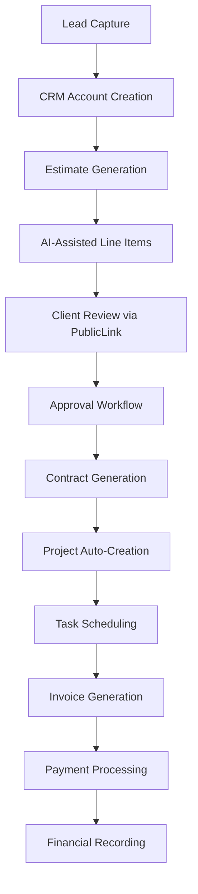
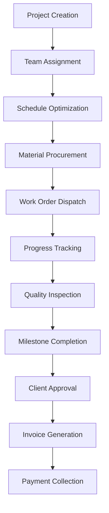
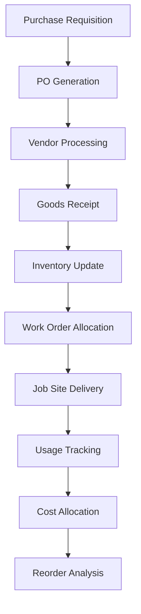

# 🏗️ **ENTERPRISE ERP PLATFORM ARCHITECTURE v2.0**

## **Executive Summary**

This enterprise-grade ERP platform represents a comprehensive solution for construction, field service, and project-based businesses. Built on modern architecture principles with AI-first design, multi-tenant capabilities, and complete audit trails, the platform delivers integrated workflows from lead generation through project completion and financial settlement.

### **🎯 Strategic Vision**

To provide an integrated business management platform that unifies estimating, project execution, financial management, and operational intelligence through advanced AI capabilities and robust enterprise architecture.

---

## **🏛️ Platform Architecture Overview**

### **Core Architecture Principles**

**Domain-Driven Design (DDD)**
- Modular architecture with clear bounded contexts
- Maximum scalability through microservice-ready design
- Well-defined interfaces between functional domains
- Complete data integrity through parent-child relationships

**Multi-Tenant Enterprise Architecture**
- Complete tenant isolation with row-level security (RLS)
- Global identity management with tenant-scoped membership
- Configurable feature flags and subscription management
- Enterprise SSO, MFA, and compliance frameworks

**AI-First Integration**
- Embedded AI capabilities across all business processes
- Multi-model support (GPT, Claude, Llama, proprietary)
- Document intelligence with OCR and semantic analysis
- Predictive analytics and automated recommendations

**Audit-First Design**
- Immutable audit trails with complete actor attribution
- Microsecond-precision timestamps with temporal tracking
- Comprehensive event sourcing across all business entities
- Built-in data classification and retention policies

---

## **📊 Platform Layers**

### **Layer 1: Identity & Security Foundation**

**Global Identity Management**
- `User` - Global authentication principals
- `Actor` - Universal "who did it" identity across audit trails
- `Session` - Cross-tenant session management
- `UserProfile` - Global user preferences and settings

**Enterprise Security**
- `IdentityProvider` - SSO integration (OIDC/SAML)
- `AuthFactor` - Multi-factor authentication management
- `SecurityEvent` - Comprehensive security audit logging
- `UserDevice` - Device trust and fingerprinting

**Tenant Foundation**
- `Tenant` - Multi-tenant organization management
- `Member` - Tenant-scoped membership directory
- `MemberSettings` - Per-tenant user preferences
- `TenantSettings` - Tenant configuration and localization

### **Layer 2: Access Control & Permissions**

**Role-Based Access Control (RBAC)**
- `Role` - Tenant-scoped role definitions
- `Permission` - Global permission catalog
- `RolePermission` - Role-to-permission mappings
- `MemberRole` - Member role assignments

**Attribute-Based Access Control (ABAC)**
- `AccessPolicy` - Complex authorization policies
- `AccessPolicyCondition` - Granular policy conditions
- `AccessScope` - Multi-dimensional scoping boundaries
- `AccessScopeAssignment` - Scope boundary assignments

**Audit & Compliance**
- `AccessAuditEvent` - Access decision audit trail
- `ServiceAccount` - Non-human identity management
- `ServiceAccountKey` - API key and credential management
- `AccessResource` - Permissionable resource registry

### **Layer 3: Customer Relationship Management (CRM)**

**Core CRM Infrastructure**
- `CRMAccount` - Master customer account records
- `CRMContact` - Person-level contact management
- `CRMAddress` - Multi-type address management
- `CRMInteraction` - Customer interaction logging

**Communication Management**
- `CRMEmail` - Email communication tracking
- `CRMEmailAttachment` - Email document management
- `CRMSMS` - SMS messaging integration
- `CRMPhoneCall` - Call logging and recordings

**Relationship Management**
- `CRMAccountRelationship` - Account hierarchies and partnerships
- `CRMContactRole` - Contact role definitions
- `CRMHousehold` - Residential customer grouping
- `CRMPartner` - External partner management

### **Layer 4: Estimating & Proposal Engine**

**Master Estimation System**
- `Estimate` - Master estimate container
- `EstimateRevision` - Immutable revision snapshots
- `EstimateSection` - Trade-based estimate organization
- `EstimateLineItem` - Granular cost components

**Commercial Terms & Conditions**
- `EstimateTax` - Tax calculations and compliance
- `EstimateDiscount` - Discount management
- `EstimateFee` - Additional charges and fees
- `EstimateTerm` - Payment and contractual terms

**Client Interaction & Approvals**
- `EstimatePublicLink` - Secure client review links
- `EstimateAssumption` - Scope assumptions
- `EstimateExclusion` - Explicit exclusions
- `EstimateAlternate` - Value engineering options

### **Layer 5: Project Management & Execution**

**Project Foundation**
- `Project` - Master project container
- `ProjectPhase` - High-level project phases
- `ProjectMilestone` - Critical deliverables and checkpoints
- `ProjectTeamMember` - Project team assignments

**Task & Schedule Management**
- `ProjectTask` - Individual work items
- `ProjectTaskAssignment` - Task-to-resource assignments
- `ProjectTaskDependency` - Task relationship management
- `ProjectSchedule` - Master project schedule container

**Risk & Quality Management**
- `ProjectRisk` - Risk identification and assessment
- `ProjectIssue` - Issue tracking and resolution
- `ProjectDailyLog` - Daily activity documentation
- `QualityInspection` - Quality assurance workflows

### **Layer 6: Financial Management & Accounting**

**Billing & Accounts Receivable**
- `Invoice` - Master billing documents
- `InvoiceLineItem` - Detailed billing components
- `InvoicePaymentApplication` - Payment allocation
- `BillingSchedule` - Multi-method billing configuration

**General Ledger & Accounting**
- `GLAccount` - Chart of accounts
- `Transaction` - Universal financial events
- `TransactionLine` - Debit/credit components
- `GLJournal` - Manual journal entries

**Banking & Cash Management**
- `BankAccount` - Company bank account registry
- `BankTransaction` - Imported bank feed data
- `BankReconciliation` - Monthly reconciliation sessions
- `Payment` - Comprehensive payment processing

### **Layer 7: Inventory & Procurement**

**Master Inventory Data**
- `InventoryItem` - Master item catalog
- `InventoryLocation` - Storage location hierarchy
- `InventoryStock` - Real-time stock levels
- `InventorySupplier` - Vendor relationship management

**Inventory Transactions**
- `InventoryTransaction` - Universal movement container
- `InventoryAdjustment` - Manual inventory corrections
- `InventoryTransfer` - Inter-location transfers
- `InventoryCount` - Physical count sessions

**Procurement Management**
- `PurchaseOrder` - Master procurement documents
- `PurchaseOrderLineItem` - Purchase line items
- `PurchaseRequisition` - Internal purchase requests
- `PurchaseOrderReceipt` - Goods received documentation

### **Layer 8: Human Resources & Payroll**

**Employee Management**
- `Employee` - Master employee records
- `EmployeePosition` - Job assignments
- `EmployeeCompensation` - Compensation tracking
- `EmployeeSkill` - Skills and certifications

**Time & Attendance**
- `Timesheet` - Employee timesheet container
- `TimesheetEntry` - Individual time entries
- `TimesheetOvertime` - Overtime calculations
- `TimesheetGeoLocation` - GPS validation

**Payroll Processing**
- `PayrollRun` - Payroll cycle execution
- `PayrollEarning` - Earnings components
- `PayrollDeduction` - Deduction management
- `PayrollTax` - Tax calculations

### **Layer 9: Operations & Field Service**

**Work Order Management**
- `WorkOrder` - Master service requests
- `WorkOrderTask` - Service task breakdown
- `WorkOrderAssignment` - Technician dispatch
- `WorkOrderMaterial` - Material usage tracking

**Scheduling & Optimization**
- `Schedule` - Master scheduling container
- `ScheduleItem` - Individual events
- `ScheduleConstraint` - Scheduling rules
- `ScheduleOptimizationRun` - AI-driven optimization

**Safety & Compliance**
- `SafetyIncident` - Incident documentation
- `SafetyInspection` - Safety inspection workflows
- `ComplianceRequirement` - Regulatory requirements
- `ComplianceAudit` - Audit management

### **Layer 10: AI & Intelligence**

**AI Core Infrastructure**
- `AIModel` - Model registry and versioning
- `AIPromptTemplate` - Reusable prompt library
- `AIAction` - Configurable automations
- `AIPlaybook` - Multi-step workflows

**Document Intelligence**
- `AIDocumentIndex` - Searchable document corpus
- `AIOCRResult` - OCR processing results
- `AIExtractionResult` - Structured data extraction
- `AIClassificationResult` - Document classification

**Business Intelligence**
- `AIInsight` - Business insights generation
- `AIPrediction` - Predictive analytics
- `AIRecommendation` - Prescriptive suggestions
- `AIForecast` - Time-series projections

### **Layer 11: Communications & Collaboration**

**Multi-Channel Messaging**
- `MessageThread` - Conversation containers
- `Message` - Individual messages
- `MessageAttachment` - File sharing
- `MessageReaction` - Engagement tracking

**Email Engine**
- `EmailMessage` - Email storage and threading
- `EmailTemplate` - Reusable email templates
- `EmailCampaign` - Bulk communication
- `EmailSendLog` - Delivery tracking

**Customer Portal**
- `CustomerPortalUser` - External user profiles
- `CustomerPortalAccess` - Feature entitlements
- `CustomerPortalDocument` - Shared documents
- `CustomerPortalMessage` - Customer communications

### **Layer 12: Analytics & Reporting**

**Core Analytics**
- `AnalyticsDataset` - Source dataset definitions
- `AnalyticsMetric` - KPI calculations
- `AnalyticsCube` - Pre-aggregated data
- `AnalyticsQuery` - Cached queries

**Dashboard Framework**
- `Dashboard` - Dashboard containers
- `DashboardWidget` - Individual visualizations
- `DashboardUserView` - Personalized layouts
- `DashboardSharing` - Collaboration features

### **Layer 13: Document Management**

**Core Document System**
- `Document` - Primary file entities
- `DocumentFolder` - Hierarchical organization
- `DocumentVersion` - Version control
- `DocumentPermission` - Access control

**Advanced Processing**
- `DocumentOCRResult` - Text extraction
- `DocumentAIExtraction` - Structured extraction
- `DocumentIndex` - Search capabilities
- `DocumentEmbedding` - Semantic analysis

---

## **🔄 Core Business Process Flows**

### **Revenue Generation Workflow**

### **Project Execution Workflow**

### **Inventory Management Flow**

---

## **🔐 Security Model & Architecture**

### **Row-Level Security (RLS) Implementation**

**Tenant Isolation Strategy**
- 85% Tenant-scoped tables (~310 tables) with RLS enforcement
- 10% Global tables (~35 tables) for master data
- 5% Hybrid tables (~18 tables) for cross-tenant functionality
- Composite foreign keys using `[tenantId, id]` pattern

**Access Control Framework**
- **RBAC**: Role-based permissions with hierarchical inheritance
- **ABAC**: Attribute-based policies for complex authorization
- **Scoped Access**: Multi-dimensional boundaries (project, department, location)
- **Service Accounts**: Non-human identity for integrations

### **Data Classification & Retention**

**Built-in Compliance**
- Data classification tags on all entities
- Automated retention policy enforcement
- GDPR/CCPA compliance frameworks
- Audit trail preservation requirements

**Financial Integrity Protection**
- Cascade deletion for ownership relationships
- Restrict deletion for financial linkages
- SetNull for optional historical references
- Immutable financial audit trails

---

## **🤖 AI Integration Architecture**

### **AI Model Registry**
- Multi-provider support (OpenAI, Anthropic, Meta, proprietary)
- Version tracking and capability mapping
- Cost optimization and performance monitoring
- A/B testing for model selection

### **Document Intelligence Pipeline**
- OCR processing for scanned documents
- Structured data extraction from invoices/POs
- Automatic document classification
- Semantic search and retrieval

### **Business Intelligence Engine**
- Predictive cost forecasting
- Schedule risk assessment
- Margin optimization recommendations
- Anomaly detection and alerts

### **Automation Workflows**
- AI-assisted estimate generation
- Automatic task creation from projects
- Smart scheduling optimization
- Intelligent vendor selection

---

## **🔌 Integration Layer**

### **External System Connectivity**
- OAuth 2.0 token management
- RESTful API integrations
- Webhook processing (inbound/outbound)
- Real-time synchronization engine

### **Supported Integrations**
- **Financial**: QuickBooks, Stripe, banking APIs
- **Communication**: Twilio, SendGrid, Slack
- **Productivity**: Microsoft 365, Google Workspace
- **Industry-Specific**: Construction software, field service platforms

### **Data Mapping & Transformation**
- Flexible field mapping configurations
- Data type conversion and validation
- Business rule application
- Error handling and retry mechanisms

---

## **📱 Multi-Channel Architecture**

### **Web Application**
- React-based responsive interface
- Real-time updates via WebSocket
- Progressive web app capabilities
- Offline functionality for critical features

### **Mobile Applications**
- Native iOS and Android apps
- GPS tracking and geofencing
- Photo capture and documentation
- Push notification delivery

### **Customer Portal**
- Secure client access interface
- Invoice viewing and payment
- Project progress tracking
- Document sharing capabilities

---

## **📊 Data Architecture**

### **Database Design**
- PostgreSQL with advanced indexing
- Partitioning for large datasets
- Read replicas for reporting
- Automated backup and recovery

### **Caching Strategy**
- Redis for session management
- Application-level caching
- CDN for static assets
- Query result optimization

### **Search Infrastructure**
- Full-text search capabilities
- Semantic vector search
- Faceted search and filtering
- Real-time index updates

---

## **🏗️ Module Registry**

### **Identity & Access Management**
| Module               | Tables | Primary Purpose                     |
| -------------------- | ------ | ----------------------------------- |
| **identity**         | 8      | Global identity, sessions, API keys |
| **identitysecurity** | 11     | MFA, SSO, security events           |
| **membership**       | 6      | Tenant membership management        |
| **accesscontrol**    | 12     | RBAC/ABAC permissions               |

### **Customer Relationship Management**
| Module               | Tables | Primary Purpose                      |
| -------------------- | ------ | ------------------------------------ |
| **crmcore**          | 10     | Account and contact management       |
| **crmcommunication** | 10     | Email, SMS, phone integration        |
| **crmrelationships** | 10     | Account hierarchies and partnerships |

### **AI & Intelligence**
| Module         | Tables | Primary Purpose                 |
| -------------- | ------ | ------------------------------- |
| **aicore**     | 10     | AI model registry and execution |
| **aidocument** | 10     | OCR and document processing     |
| **aiinsights** | 10     | Business intelligence           |

### **Business Operations**
| Module                    | Tables | Primary Purpose                   |
| ------------------------- | ------ | --------------------------------- |
| **estimate**              | 17     | Comprehensive estimating system   |
| **projectsCore**          | 10     | Project management foundation     |
| **projectTaskScheduling** | 10     | Advanced scheduling and tasks     |
| **projectRisk**           | 10     | Risk management and daily logging |
| **changeorder**           | 9      | Contract modification management  |

### **Financial Management**
| Module                        | Tables | Primary Purpose                  |
| ----------------------------- | ------ | -------------------------------- |
| **invoice**                   | 17     | Billing and accounts receivable  |
| **generalledger**             | 10     | Chart of accounts and journals   |
| **accountingtransaction**     | 9      | Universal transaction processing |
| **banking**                   | 10     | Bank account and reconciliation  |
| **paymentsARCashApplication** | 10     | Payment processing               |
| **billing**                   | 10     | Advanced billing and retainage   |
| **taxcompliance**             | 10     | Tax jurisdiction management      |

### **Human Resources**
| Module             | Tables | Primary Purpose                  |
| ------------------ | ------ | -------------------------------- |
| **hrcore**         | 10     | Employee lifecycle management    |
| **payroll**        | 10     | Comprehensive payroll processing |
| **timeattendance** | 9      | Time tracking and attendance     |

### **Inventory & Procurement**
| Module                    | Tables | Primary Purpose               |
| ------------------------- | ------ | ----------------------------- |
| **inventoryCore**         | 10     | Master inventory data         |
| **inventoryTransactions** | 10     | Inventory movement tracking   |
| **inventoryControl**      | 10     | Loss prevention and analytics |
| **procurementPo**         | 9      | Purchase order management     |

### **Operations & Field Service**
| Module             | Tables | Primary Purpose                |
| ------------------ | ------ | ------------------------------ |
| **workOrders**     | 10     | Field service management       |
| **schedulingCore** | 10     | Universal scheduling engine    |
| **scheduling**     | 10     | Advanced optimization          |
| **safety**         | 10     | Safety and incident management |

### **Communications**
| Module          | Tables | Primary Purpose         |
| --------------- | ------ | ----------------------- |
| **messaging**   | 10     | Real-time messaging     |
| **emailengine** | 10     | Enterprise email system |
| **smscalls**    | 10     | SMS and telephony       |

### **Analytics & Reporting**
| Module         | Tables | Primary Purpose               |
| -------------- | ------ | ----------------------------- |
| **analytics**  | 10     | Core analytics infrastructure |
| **dashboards** | 10     | Dashboard framework           |

### **Document & Content Management**
| Module            | Tables | Primary Purpose                |
| ----------------- | ------ | ------------------------------ |
| **documentscore** | 10     | Document management system     |
| **documentsai**   | 10     | AI-powered document processing |
| **esignature**    | 10     | Electronic signature workflows |

### **Specialized Modules**
| Module                      | Tables | Primary Purpose                  |
| --------------------------- | ------ | -------------------------------- |
| **customerportal**          | 10     | External customer access         |
| **compliance**              | 10     | Regulatory compliance            |
| **contracts**               | 10     | Contract lifecycle management    |
| **quality**                 | 10     | Quality assurance workflows      |
| **RFI**                     | 10     | Request for information          |
| **submittals**              | 10     | Submittal review workflows       |
| **tasks**                   | 10     | Universal task management        |
| **approvals**               | 10     | Central approval workflows       |
| **notifications**           | 10     | Multi-channel notifications      |
| **expenses**                | 6      | Corporate card management        |
| **expensecore**             | 9      | Employee expense reporting       |
| **maintenanceService**      | 10     | Service contract management      |
| **roomModel**               | 10     | Digital twin room modeling       |
| **roomScanner**             | 10     | LiDAR and AR scanning            |
| **weatherIntelligenceCore** | 10     | Weather data integration         |
| **weatherImpactAlerts**     | 10     | Weather impact analysis          |
| **zeroLoss**                | 10     | Loss prevention system           |
| **integrationsCore**        | 10     | External system integration      |
| **integrationsSyncEngine**  | 10     | Real-time synchronization        |
| **tenant**                  | 10     | Multi-tenant platform management |
| **jobCosting**              | 10     | Project cost tracking            |

---

## **🔄 Universal Approval Framework**

The platform implements a centralized approval system that serves all business processes requiring authorization workflows.

### **Central Approvals Module**
- `ApprovalRequest` - Universal approval containers
- `ApprovalRule` - Configurable business rules
- `ApprovalLevel` - Sequential and parallel chains
- `ApprovalDecision` - Approver actions and decisions
- `ApprovalEscalation` - SLA and timeout management

### **Integrated Approval Workflows**
- **Estimates**: Amount-based routing and client approval
- **Change Orders**: Scope and cost impact approvals
- **Purchase Orders**: Procurement authorization
- **Expense Reports**: Policy compliance verification
- **Payroll**: Exception and overtime approval
- **Time-off Requests**: Manager authorization
- **Journal Entries**: Financial control approval

---

## **📈 Performance & Scalability**

### **Database Optimization**
- Composite indexing for tenant isolation
- Partitioning strategies for large datasets
- Connection pooling and query optimization
- Automated maintenance and statistics

### **Application Architecture**
- Microservice-ready modular design
- Horizontal scaling capabilities
- Load balancing and failover
- Performance monitoring and alerting

### **Caching Strategy**
- Multi-layer caching architecture
- Session state management
- API response optimization
- Real-time invalidation

---

## **🛡️ Compliance & Governance**

### **Regulatory Compliance**
- GDPR and CCPA data protection
- SOX financial controls
- Industry-specific regulations (OSHA, EPA)
- International accounting standards

### **Audit & Forensics**
- Immutable audit trails
- Complete actor attribution
- Temporal data tracking
- Forensic investigation capabilities

### **Data Governance**
- Classification and tagging
- Retention policy automation
- Data quality monitoring
- Privacy by design principles

---

## **🔮 Future Architecture Considerations**

### **Emerging Technologies**
- Blockchain for contract verification
- IoT integration for equipment monitoring
- Machine learning model deployment
- Advanced analytics and predictive modeling

### **Scalability Roadmap**
- Kubernetes orchestration
- Event-driven microservices
- Global CDN deployment
- Multi-region data replication

### **Innovation Pipeline**
- Augmented reality for field operations
- Computer vision for quality inspection
- Natural language processing for document analysis
- Robotic process automation for repetitive tasks

---

## **Appendix: Complete Module → Tables Index**

### **AccessControl Module (12 tables)**
- Role, Permission, RolePermission, MemberRole
- AccessPolicy, AccessPolicyCondition, AccessScope, AccessScopeAssignment
- AccessResource, AccessAuditEvent, ServiceAccount, ServiceAccountKey

### **AiCore Module (10 tables)**
- AIModel, AIModelVersion, AIPromptTemplate, AIAction
- AIActionRun, AIPlaybook, AIPlaybookStep, AIEmbedding
- AIJob, AIJobArtifact

### **AiDocument Module (10 tables)**
- AIDocumentIndex, AIDocumentChunk, AIOCRResult, AIExtractionResult
- AIClassificationResult, AIDocumentAttachment, AIDocumentHistoryEvent, AIAnnotation
- AIEntity, AIInsightFeedback

### **AiInsights Module (10 tables)**
- AIInsight, AIInsightHistory, AIPrediction, AIRecommendation
- AIAnomaly, AITrend, AIForecast, AIWhatIfRun, AIInsightAttachment

### **Approvals Module (10 tables)**
- ApprovalRequest, ApprovalRule, ApprovalLevel, ApprovalDecision
- ApprovalAssignment, ApprovalStep, ApprovalEscalation, ApprovalCondition
- ApprovalAttachment, ApprovalHistoryEvent

### **Billing Module (10 tables)**
- BillingSchedule, BillingMilestone, BillingProgress, BillingRetainage
- BillingDeposit, BillingAdjustment, ReceivableLedger, ReceivablePaymentApplication
- ReceivableAgingSnapshot, BillingHistoryEvent

### **ChangeOrder Module (9 tables)**
- ChangeOrder, ChangeOrderLineItem, ChangeOrderReason, ChangeOrderImpact
- ChangeOrderScheduleImpact, ChangeOrderScope, ChangeOrderAttachment, ChangeOrderRevision
- ChangeOrderHistoryEvent

### **CrmCore Module (10 tables)**
- CRMAccount, CRMContact, CRMAddress, CRMInteraction
- CRMInteractionAttachment, CRMNote, CRMTag, CRMAccountTag
- CRMActivity, CRMHistoryEvent

### **CrmCommunication Module (10 tables)**
- CRMEmail, CRMEmailAttachment, CRMSMS, CRMPhoneCall
- CRMPhoneCallRecording, CRMMessageThread, CRMMessageParticipant, CRMChannel
- CRMNotificationSetting, CRMNotificationEvent

### **CrmRelationships Module (10 tables)**
- CRMAccountRelationship, CRMContactRole, CRMAccountHierarchy, CRMHousehold
- CRMHouseholdMember, CRMDecisionMaker, CRMInfluencer, CRMPartner
- CRMRelationshipAttachment, CRMRelationshipHistoryEvent

### **CustomerPortal Module (10 tables)**
- CustomerPortalUser, CustomerPortalSession, CustomerPortalAccess, CustomerPortalProjectView
- CustomerPortalEstimateView, CustomerPortalInvoiceView, CustomerPortalPaymentMethod, CustomerPortalMessage
- CustomerPortalDocument, CustomerPortalHistoryEvent

### **Analytics Module (10 tables)**
- AnalyticsDataset, AnalyticsDatasetField, AnalyticsCube, AnalyticsMetric
- AnalyticsDimension, AnalyticsFilter, AnalyticsQuery, AnalyticsInsight
- AnalyticsInsightHistoryEvent, AnalyticsAttachment

### **Dashboards Module (10 tables)**
- Dashboard, DashboardWidget, DashboardWidgetConfig, DashboardUserView
- DashboardSchedule, DashboardBookmark, DashboardSharing, DashboardTemplate
- DashboardFolder, DashboardHistoryEvent

### **DocumentsCore Module (10 tables)**
- Document, DocumentFolder, DocumentVersion, DocumentRevision
- DocumentComment, DocumentTag, DocumentShareLink, DocumentPermission
- DocumentAttachment, DocumentHistoryEvent

### **DocumentsAi Module (10 tables)**
- DocumentOCRResult, DocumentAIExtraction, DocumentAIClassification, DocumentAnnotation
- DocumentIndex, DocumentChunk, DocumentEmbedding, DocumentTrainingSample
- DocumentAIModel, DocumentAIHistory

### **ESignature Module (10 tables)**
- ESignatureEnvelope, ESignatureDocument, ESignatureRecipient, ESignatureRecipientAction
- ESignatureField, ESignatureAuditTrail, ESignatureWorkflowStep, ESignatureAttachment
- ESignatureNotification, ESignatureHistoryEvent

### **Messaging Module (10 tables)**
- MessageThread, Message, MessageParticipant, MessageAttachment
- MessageReaction, MessageMention, MessageVisibilityRule, MessageReadReceipt
- MessagePin, MessageHistoryEvent

### **EmailEngine Module (10 tables)**
- EmailMessage, EmailRecipient, EmailAttachment, EmailTemplate
- EmailCampaign, EmailAccount, EmailThreadLink, EmailSendLog
- EmailBounce, EmailHistoryEvent

### **SmsCalls Module (10 tables)**
- SMSMessage, SMSAttachment, SMSHistoryEvent, PhoneCall
- PhoneCallRecording, PhoneCallHistoryEvent, PhoneIVRMenu, PhoneQueue
- PhoneNumberPool, CommunicationProvider

### **Compliance Module (10 tables)**
- ComplianceRequirement, ComplianceDocument, ComplianceCheck, ComplianceViolation
- ComplianceCorrectionAction, ComplianceAudit, ComplianceAuditFinding, ComplianceTrainingRecord
- ComplianceAttachment, ComplianceHistory

### **Contracts Module (10 tables)**
- Contract, ContractScope, ContractTerm, ContractDeliverable
- ContractMilestone, ContractAmendment, ContractAttachment, ContractSignature
- ContractCompliance, ContractHistoryEvent

### **Estimate Module (17 tables)**
- Estimate, EstimateRevision, EstimateSection, EstimateLineItem
- EstimateTax, EstimateDiscount, EstimateFee, EstimateTerm
- EstimateAssumption, EstimateExclusion, EstimateAlternate, EstimateAttachment
- EstimateComment, EstimateComparison, EstimateHistoryEvent, EstimatePublicLink

### **ExpenseCore Module (9 tables)**
- ExpenseReport, ExpenseLine, ExpenseCategory, ExpenseReceipt
- ExpensePolicy, ExpensePolicyViolation, ExpensePayment, ExpenseAttachment
- ExpenseHistoryEvent

### **Expenses Module (10 tables)**
- CorpCard, CorpCardTransaction, CorpCardReconciliation, CorpCardLimit
- CorpCardDispute, CorpCardVendor, CorpCardReceipt, CorpCardAttachment
- CorpCardHistoryEvent, CorpCardStatement

### **GeneralLedger Module (10 tables)**
- GLAccount, GLAccountCategory, GLAccountSegment, GLFiscalYear
- GLFiscalPeriod, GLJournal, GLJournalLine, GLPostingBatch
- GLTrialBalanceSnapshot, GLHistoryEvent

### **AccountingTransaction Module (9 tables)**
- Transaction, TransactionLine, TransactionSourceLink, TransactionType
- TransactionBatch, TransactionAttachment, TransactionReversal, TransactionAllocation
- TransactionHistoryEvent

### **Banking Module (10 tables)**
- BankAccount, BankTransaction, BankReconciliation, BankReconciliationItem
- BankFeedConnection, BankStatement, BankRule, BankTransfer
- BankDeposit, BankHistoryEvent

### **TaxCompliance Module (10 tables)**
- TaxJurisdiction, TaxRate, TaxCode, TaxRule
- TaxLiability, TaxPayment, TaxReturn, TaxFilingAttachment
- TaxExemptionCertificate, TaxHistoryEvent

### **HrCore Module (10 tables)**
- Employee, EmployeeAddress, EmployeeContact, EmployeePosition
- EmployeeDepartment, EmployeeCompensation, EmployeeStatus, EmployeeSkill
- EmployeeDocument, EmployeeHistoryEvent

### **Payroll Module (10 tables)**
- PayrollRun, PayrollEarning, PayrollDeduction, PayrollTax
- PayrollCalendar, PayrollBenefit, PayrollGarnishment, PayrollCheck
- PayrollDirectDeposit, PayrollHistoryEvent

### **TimeAttendance Module (9 tables)**
- Timesheet, TimesheetEntry, TimesheetBreak, TimesheetOvertime
- TimesheetGeoLocation, TimesheetSignature, TimesheetAdjustment, TimesheetExport
- TimesheetHistoryEvent

### **Identity Module (8 tables)**
- Actor, User, Session, UserProfile
- UserSetting, UserApiKey, UserInvitation, UserHistoryEvent

### **Membership Module (6 tables)**
- Member, MemberSettings, MemberInvitation, MemberExternalLink
- MemberDocument, MemberHistoryEvent

### **IdentitySecurity Module (11 tables)**
- IdentityProvider, TenantIdentityProvider, AuthFactor, AuthFactorChallenge
- PasswordResetToken, AccountLockout, SecurityEvent, SSOSession
- RecoveryCode, UserDevice, UserDeviceHistory

### **IntegrationsCore Module (10 tables)**
- IntegrationConnection, IntegrationProvider, IntegrationOAuthToken, IntegrationApiKey
- IntegrationMapping, IntegrationFieldTransform, IntegrationEvent, IntegrationError
- IntegrationAttachment, IntegrationConnectionHistory

### **IntegrationsSyncEngine Module (10 tables)**
- IntegrationSyncJob, IntegrationSyncLog, IntegrationWebhook, IntegrationWebhookDelivery
- IntegrationInboundWebhook, IntegrationQueueItem, IntegrationRateLimit, IntegrationRetryPolicy
- IntegrationSchemaVersion, IntegrationHistoryEvent

### **InventoryCore Module (10 tables)**
- InventoryItem, InventoryCategory, InventoryLocation, InventoryBin
- InventoryUnitOfMeasure, InventoryStock, InventorySupplier, InventoryItemVendor
- InventoryAttachment, InventoryHistoryEvent

### **InventoryTransactions Module (10 tables)**
- InventoryTransaction, InventoryTransactionLine, InventoryAdjustment, InventoryTransfer
- InventoryTransferLine, InventoryReturn, InventoryReturnLine, InventoryCount
- InventoryCountLine, InventoryTransactionHistory

### **InventoryControl Module (10 tables)**
- InventoryLossEvent, InventoryLossCause, InventoryLossInvestigation, InventoryAudit
- InventoryAuditLine, InventoryReservation, InventoryCommitment, InventoryReorderPoint
- InventorySafetyStock, InventoryControlHistory

### **Invoice Module (17 tables)**
- Invoice, InvoiceLineItem, InvoiceTax, InvoiceDiscount
- InvoiceFee, InvoiceRetainage, InvoiceProgress, InvoiceMilestone
- InvoicePaymentApplication, InvoiceAttachment, InvoiceComment, InvoiceRevision
- InvoiceAdjustment, InvoiceCredit, InvoiceDebit, InvoiceHistory
- InvoicePublicLink, InvoiceReminder

### **JobCosting Module (10 tables)**
- CostCode, CostCategory, CostType, CostCenter
- JobCostLedger, JobCostLine, JobCostBudget, JobCostBudgetLine
- JobCostForecast, JobCostHistoryEvent

### **MaintenanceService Module (10 tables)**
- ServiceContract, ServiceContractPlan, ServiceContractSchedule, ServiceContractTask
- ServiceContractPricing, ServiceContractPaymentMethod, ServiceContractRenewal, ServiceContractCancelation
- ServiceContractNotification, ServiceContractHistoryEvent

### **Notifications Module (10 tables)**
- Notification, NotificationPreference, NotificationChannel, NotificationTemplate
- NotificationDelivery, NotificationDigest, NotificationRule, NotificationQueueItem
- NotificationAttachment, NotificationHistoryEvent

### **PaymentsARCashApplication Module (10 tables)**
- Payment, PaymentMethod, PaymentGatewayTransaction, PaymentApplication
- PaymentUnapplied, PaymentRefund, PaymentReconciliation, PaymentDispute
- PaymentAttachment, PaymentHistoryEvent

### **ProcurementPo Module (9 tables)**
- PurchaseOrder, PurchaseOrderLineItem, PurchaseRequisition, PurchaseRequisitionItem
- PurchaseOrderReceipt, PurchaseOrderReceiptItem, PurchaseOrderReturn, PurchaseOrderAttachment
- PurchaseOrderHistoryEvent

### **ProjectsCore Module (10 tables)**
- Project, ProjectPhase, ProjectMilestone, ProjectTeamMember
- ProjectLocation, ProjectBudget, ProjectBudgetLineItem, ProjectDocument
- ProjectAttachment, ProjectHistoryEvent

### **ProjectTaskScheduling Module (10 tables)**
- ProjectTask, ProjectTaskAssignment, ProjectTaskDependency, ProjectSchedule
- ProjectScheduleItem, ProjectCriticalPath, ProjectBaseline, ProjectChecklistItem
- ProjectTaskComment, ProjectTaskAttachment

### **ProjectRisk Module (10 tables)**
- ProjectRisk, ProjectIssue, ProjectDecision, ProjectDailyLog
- ProjectDailyLogLabor, ProjectDailyLogEquipment, ProjectDailyLogMaterial, ProjectDailyLogPhoto
- ProjectProgress, ProjectNote

### **Quality Module (10 tables)**
- QualityInspection, QualityInspectionItem, QualityNonConformance, QualityNonConformanceAction
- QualityPunchListItem, QualityMaterialTest, QualityMaterialTestResult, QualityStandard
- QualityAttachment, QualityInspectionHistory

### **Rfi Module (10 tables)**
- RFI, RFIQuestion, RFIResponse, RFIAttachment
- RFIComment, RFIStatus, RFICategory, RFIImpact
- RFIRecipient, RFIHistoryEvent

### **RoomModel Module (10 tables)**
- RoomModel, RoomModelWall, RoomModelOpening, RoomModelSurface
- RoomModelItem, RoomModelMeasurement, RoomModelTakeoff, RoomModelCostMapping
- RoomModelAttachment, RoomModelHistoryEvent

### **RoomScanner Module (10 tables)**
- RoomScanSession, RoomScanFrame, RoomScanPointCloud, RoomScanMesh
- RoomScanSemanticLabel, RoomScanProcessing, RoomScanCalibration, RoomScanMetadata
- RoomScanOutput, RoomScanHistoryEvent

### **Safety Module (10 tables)**
- SafetyIncident, SafetyIncidentPerson, SafetyIncidentInvestigation, SafetyIncidentCorrectiveAction
- SafetyInspection, SafetyInspectionItem, SafetyHazard, SafetyTrainingRecord
- SafetyWeatherRisk, SafetyIncidentHistoryEvent

### **SchedulingCore Module (10 tables)**
- Schedule, ScheduleItem, ScheduleAssignment, ScheduleAvailability
- ScheduleTimeOff, ScheduleException, ScheduleShift, ScheduleResource
- ScheduleNote, ScheduleHistoryEvent

### **Scheduling Module (10 tables)**
- ScheduleConstraint, ScheduleConstraintRule, ScheduleOptimizationRun, ScheduleOptimizationResult
- ScheduleConflictingItem, ScheduleTravelTime, ScheduleWeatherAdjustment, ScheduleForecast
- ScheduleCapacity, ScheduleAIRecommendation

### **Submittals Module (10 tables)**
- Submittal, SubmittalItem, SubmittalReview, SubmittalAttachment
- SubmittalStatus, SubmittalSpecSection, SubmittalReviewer, SubmittalWorkflowStep
- SubmittalDistribution, SubmittalHistoryEvent

### **Tasks Module (10 tables)**
- Task, TaskAssignment, TaskChecklistItem, TaskComment
- TaskAttachment, TaskReminder, TaskDependency, TaskLabel
- TaskLabelAssignment, TaskHistoryEvent

### **Tenant Module (10 tables)**
- Tenant, TenantSettings, TenantSubscription, TenantUsageRecord
- TenantDomain, TenantBranding, TenantModule, TenantFeatureFlag
- TenantComplianceSetting, TenantHistoryEvent

### **WeatherIntelligenceCore Module (10 tables)**
- WeatherStation, WeatherObservation, WeatherForecast, WeatherAlert
- WeatherCondition, WeatherDataSource, WeatherAttachment, WeatherSensor
- WeatherSensorReading, WeatherHistoryEvent

### **WeatherImpactAlerts Module (10 tables)**
- WeatherImpactRule, WeatherImpactCondition, WeatherProjectForecast, WeatherImpactEvent
- WeatherImpactTask, WeatherImpactNotification, WeatherDelayRecommendation, WeatherRiskAssessment
- WeatherMitigation, WeatherImpactHistoryEvent

### **WorkOrders Module (10 tables)**
- WorkOrder, WorkOrderTask, WorkOrderAssignment, WorkOrderMaterial
- WorkOrderLabor, WorkOrderNote, WorkOrderAttachment, WorkOrderSignature
- WorkOrderInvoiceLink, WorkOrderHistoryEvent

### **ZeroLoss Module (10 tables)**
- ZeroLossEvent, ZeroLossItem, ZeroLossCause, ZeroLossInvestigation
- ZeroLossCorrectiveAction, ZeroLossAnalytics, ZeroLossAlert, ZeroLossAuditTrail
- ZeroLossPreventionPlan, ZeroLossHistoryEvent

---

**Total Platform Scale**: 62 modules containing 620 tables providing comprehensive enterprise business management capabilities with complete audit trails, multi-tenant architecture, and AI-first integration across all business processes.